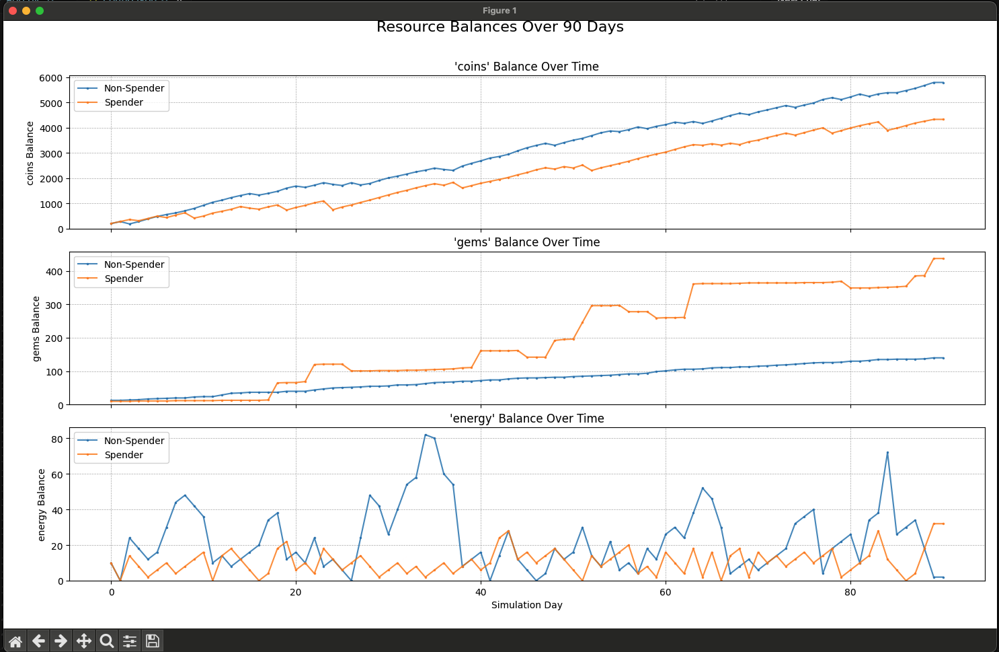

# 🎮 LazySim - A Simple F2P Economy Simulation Tool 📈

## Overview

LazySim provides a framework for simulating the economy of Free-to-Play (F2P) games using Python and the `SimPy` discrete-event simulation library. It allows game designers to model resources, player actions (sources, sinks, converters), player personas with different behavioral patterns, and In-App Purchases (IAPs) through a flexible JSON configuration file.

The simulation tracks resource balances over time for different player personas and generates summary statistics and plots to help analyze and balance the game economy.

---

## ✨ Features

* **Configurable Economy:** Define multiple resources, actions (earning/spending), and IAP tiers via `config.json`.
* **Player Personas:** Model different player types with varying action frequencies and IAP propensities.
* **Discrete-Event Simulation:** Uses `SimPy` for simulating events day-by-day.
* **Resource Modeling:** Handles initial balances, caps, and daily regeneration rates.
* **Action Types:** Supports sources (generate resources), sinks (consume resources), converters (consume & generate), and IAPs.
* **Randomness:** Incorporates randomness in action outputs (min/max amounts) and action attempt frequency (Poisson distribution).
* **Time-Series Tracking:** Records resource balances daily for each player.
* **Visualization:** Generates plots showing resource balance evolution over time using `Matplotlib`.
* **Command-Line Interface:** Accepts the configuration file path as an argument.

---

## 🖼️ Example Output Plot

*(This shows an example plot generated by the tool using sample data)*



---

## ⚙️ Requirements

* Python 3.7+
* Libraries:
    * `simpy`
    * `pandas`
    * `matplotlib`
    * `numpy` (`<2.0` recommended for compatibility with older pandas/other libraries if needed, check your environment).

---

## 🚀 Setup

1.  **Clone/Download:** Get the project files (`gen-sim.py` and `config.json`). Make sure `screen.png` (or your desired screenshot) is also present.
2.  **Create Virtual Environment (Recommended):**
    ```bash
    python3 -m venv venv
    source venv/bin/activate  # On Windows use `venv\Scripts\activate`
    ```
3.  **Install Requirements:**
    ```bash
    pip install simpy pandas matplotlib "numpy<2.0"
    # Or use numpy>=2.0 if your pandas/other libs support it
    ```

---

## 🔧 Configuration (`config.json`)

The core of the simulation is defined in the `config.json` file (or a file specified via the command line). It has three main sections:

**1. `simulation`**: General settings for the simulation run.

* `duration_days`: (Number) How many days to simulate.
* `random_seed`: (Number or `null`) Seed for reproducibility (use `null` or omit for non-deterministic).
* `print_logs`: (Boolean) `true` to print detailed daily logs, `false` for concise output.
* `plot_results`: (Boolean) `true` to generate and show plots, `false` otherwise.

**2. `economy`**: Defines the game's economic elements.

* `resources`: (List of Objects) Each resource object has:
    * `id`: (String) Unique identifier (e.g., "coins", "gems"). **Required.**
    * `initial_balance`: (Number) Starting amount. **Required.**
    * `cap` (optional): (Number) Maximum amount player can hold.
    * `regen_rate_per_day` (optional): (Number) Amount regenerated automatically each day.
* `actions`: (List of Objects) Each action object has:
    * `id`: (String) Unique identifier (e.g., "play_level", "buy_item"). **Required.**
    * `type`: (String) "source", "sink", "converter", or "iap". **Required.**
    * `frequency_type` (optional): (String) "daily" if the action should trigger exactly once per day if affordable (like a login bonus). Otherwise, frequency is controlled by persona probabilities.
    * `costs` (optional): (List of Objects) Resource costs (`[{"resource_id": "energy", "amount": 10}]`).
    * `outputs` (optional): (List of Objects) Resources generated (`[{"resource_id": "coins", "amount": 50}]` or `[{"resource_id": "coins", "amount_min": 5, "amount_max": 20}]`).
    * `iap_tier_id` (optional): (String) Links to a key in `iap_tiers`. **Required if `type` is "iap"**.
* `iap_tiers`: (Object) Dictionary defining IAP offers. Keys are tier IDs. Values are objects with:
    * `name`: (String) Display name. **Required.**
    * `cost_usd`: (Number) Real-world cost (for tracking). **Required.**
    * `resource_id`: (String) The primary resource granted. **Required.**
    * `amount`: (Number) The amount granted. **Required.**

**3. `personas`**: Defines different player types. Keys are persona IDs. Values are objects with:

* `name`: (String) Display name. **Required.**
* `action_probabilities_per_day`: (Object) Dictionary mapping `action_id` to the *average number of times* this persona attempts the action per day (can be fractional or > 1). Uses Poisson distribution for attempts. **Required.**
* `redemption_buffer_factor` (optional): (Number) Multiplier for costs when deciding to spend (e.g., 1.1 means balance must be 110% of cost). (Note: Currently used in Winin version, adaptable for generic spending logic).

> **Note:** Refer to the example `config.json` for a complete structure example.

---

## ▶️ Usage

Run the simulation from your terminal:

```bash
# Using the default config.json in the same directory
python3 gen-sim.py

# Specifying a different configuration file
python3 gen-sim.py --config my_custom_config.json

# Or using the short flag
python3 gen-sim.py -c path/to/another_config.json
```

---

## 📊 Output

1.  **Console Logs:** If `print_logs` is `true`, detailed daily actions for each player will be printed.
2.  **Final Player Summary:** A table showing the final state for each player persona:
    * Final balances for all resources.
    * Total simulated IAP spend (USD).
    * *(Optionally add action counts or other stats in future versions).*
3.  **Plots:** If `plot_results` is `true`, one or more plots will be displayed showing the balance of each resource over the simulation duration for all personas (like the example image above).

---

## 🔮 Potential Next Steps / Contributing

* Implement more sophisticated player decision-making (e.g., saving for specific goals, IAP triggers based on resource scarcity).
* Add more detailed statistics tracking (e.g., resource flow rates per source/sink).
* Improve visualization (more plot types, customizable plots).
* Add support for saving results to files (CSV, JSON).
* Implement population simulation (running many instances of each persona).
* Enhance configuration validation.

